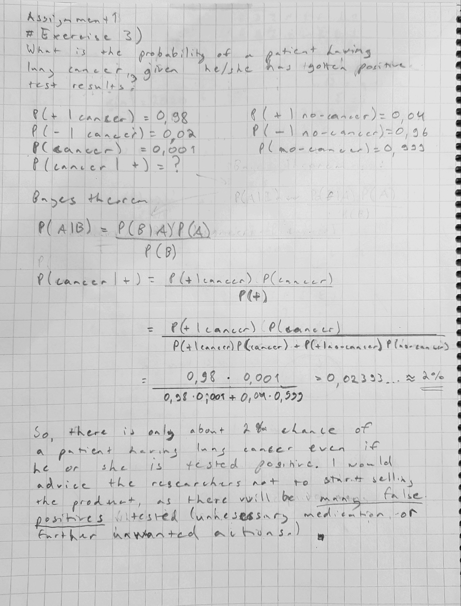

```{r setup, include=FALSE}
knitr::opts_chunk$set(echo = TRUE)
```

## R Markdown

This is an R Markdown document. Markdown is a simple formatting syntax for authoring HTML, PDF, and MS Word documents. For more details on using R Markdown see <http://rmarkdown.rstudio.com>.

When you click the **Knit** button a document will be generated that includes both content as well as the output of any embedded R code chunks within the document. You can embed an R code chunk like this:

Note that the `echo = FALSE` parameter was added to the code chunk to prevent printing of the R code that generated the plot.

```{r}
# To install aaltobda, see the General information in the assignment.
library(aaltobda)
library(markmyassignment)
assignment_path <-paste("https://github.com/avehtari/BDA_course_Aalto/", "blob/master/assignments/tests/assignment1.yml", sep="")
set_assignment(assignment_path)
```

# Exercise 1)

Probability:
Probability is the measure of the likelihood that an event will occur in a Random Experiment. Probability is quantified as a number between 0 and 1, where, loosely speaking, 0 indicates impossibility and 1 indicates certainty. The higher the probability of an event, the more likely it is that the event will occur.

Probability mass:
Probability for a discrete random variable to have a single outcome in the sample space.

Probability density:
Probability for a continuous random variable to have a single outcome or a range of outcomes in the sample space.

Probability mass function (pmf):
Probability mass function (PMF) is a function that gives the probability that a discrete random variable is exactly equal to one possible outcome.

Probability density function (pdf):
A function of a continuous random variable, whose integral across an interval gives the probability that the value of the variable lies within the same interval.

Probability distribution:
A mathematical function that maps the all possible outcomes of an random experiment with it’s associated probability. 

Discrete probability distribution:
Probability distribution of a discrete random variable is called discrete probability distribution.

Continuous probability distribution:
Probability distribution of a continuous random variable is called continuous probability distribution.

Cumulative distribution function (cdf):
CDF gives the probability that a real-valued random variable is less than or equal to the independent variable of the function.

Likelihood:
The state of being likely or probable.

# Exercise 2)
## a)
```{r}
alpha <- 0.2*((0.2*(1-0.2)/0.01^2)-1)
beta <- alpha*(1-0.2)/0.2
x<-seq(0,1,length.out = 100)
dist<-dbeta(x, alpha, beta)
plot(x, dist, ylab="density", type ="l", col=4)
```
## b)
```{r}
sample<-rbeta(1000,alpha,beta)
hist(sample)
```
The density function seemed to have most of the density around the mean 0.2. When taking random sample with n=1000 from the same distribution, as one could assume, the histogram seems to follow a normal distribution around the mean 0.2. So, from this we can
already assume that the sample mean and variance should be pretty close to the real value mean 0.2 at least. Let' see.
## c)
```{r}
mean(sample)
# => 0.200482
var(sample)
# => 9.925429e-05
```
The mean roughly matches with the true mean but variance is a lot smaller compared to the true variance.
## d)
```{r}
quantile(sample, c(0.025, 0.975))
```
# Exercise 3)
```{r, out.width = "250px"}

```

# Exercise 4)
## a)
```{r}
boxes<-boxes <- matrix(c(2,4,1,5,1,3), ncol = 2,
                       dimnames = list(c("A", "B", "C"),
                                       c("red","white")))
p_red<-function(boxes){
  a<-boxes[1,1]/sum(boxes[1, c(1,2)])*0.4
  b<-boxes[2,1]/sum(boxes[2, c(1,2)])*0.1
  c<-boxes[3,1]/sum(boxes[3, c(1,2)])*0.5
  
  a+b+c
}
p_red(boxes=boxes)
```
## b)
```{r}
p_box<-function(boxes){
  a<-(boxes[1,1]/sum(boxes[1, c(1,2)])*0.4)/p_red(boxes = boxes)
  b<-(boxes[2,1]/sum(boxes[2, c(1,2)])*0.1)/p_red(boxes = boxes)
  c<-(boxes[3,1]/sum(boxes[3, c(1,2)])*0.5)/p_red(boxes = boxes)
  c(a, b, c)
}
p_box(boxes=boxes)
```
If red ball was picked, it most probably came from box C.
```{r}
mark_my_assignment()
```
# Exercise 5)
```{r}
p_identical_twin<-function(fraternal_prob, identical_prob){
  pr_identical_and_twin_bros<-identical_prob*0.5
  pr_fraternal_and_twin_bros<-fraternal_prob*0.5*0.5
  
  pr_identical_and_twin_bros/(pr_identical_and_twin_bros+pr_fraternal_and_twin_bros)
}
p_identical_twin(fraternal_prob=1/150, identical_prob=1/400)
```
```{r}
mark_my_assignment()
```