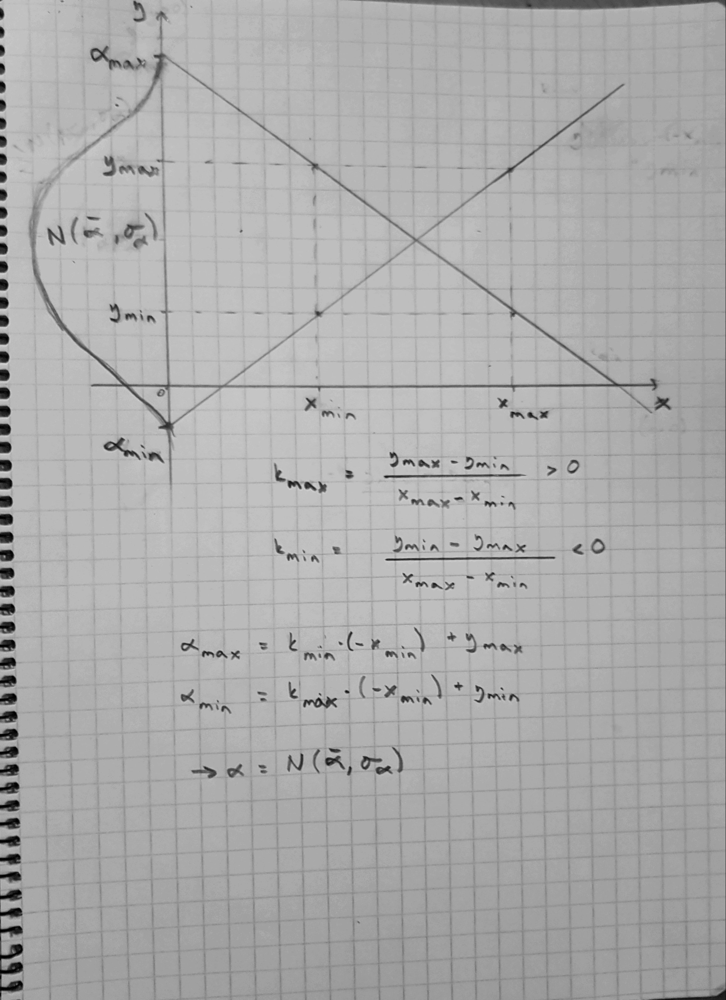

---
output:
  pdf_document: default
  html_document: default
---
----
title: "BDA - Assignment 7"
author: "Anonymous"
output: 
  pdf_document: 
    toc: yes
    toc_depth: 1
---

```{r setup, include=FALSE}
knitr::opts_chunk$set(echo = TRUE)
```

```{r}
# To install aaltobda, see the General information in the assignment.
library(aaltobda)
library("ggplot2")
library(rstan)
```

# 1. Linear model: drowning data with Stan (3p)

The provided data drowning in the aaltobda package contains the number of people who died from drowning each year in Finland 1980–2019. A statistician is going to fit a linear model with Gaussian residual model to these data using time as the predictor and number of drownings as the target variable (see the related linear model example for the Kilpisj¨arvi-temperature data in the example Stan codes). She has two objective questions:

  i)  What is the trend of the number of people drowning per year? We would plot the
      histogram of the slope of the linear model.
  ii) What is the prediction for the year 2020? We would plot the histogram of the 
      posterior predictive distribution for the number of people drowning at ˜x = 2020.

Your task is to fix the Stan code to be able to run this linear regression model.

The data for the assignment.

```{r}
data("drowning")
```

## 1.

The three mistakes in the code and how I fixed them:

  1. The first mistake was that there was no semi-colon at the end of the row where the model was defined. Fix: Added the the semi-colon.
  2. The standard deviatoin parameter sigma had upper bound set. There should not be a upper bound for this parameter. Only contraint is that it cannot be negative. Fix: Change upper bound constraint to lower bound constraint.
  3. The quantity ypred is a real number drawn from a normal distribution. There was mu as a parameter for the normal distribution in the initial code. This caused error, because mu is a vector of dimension N. Fix: For ypred, we need to use xpred when transforming parameter mupred. This way, we get real number mupred, which we can give as a parameter to normal distribution where the ypred is to be sampled from.
  
The fixed mistakes are also commented on the corresponding lines within the Stan model code.

## 2.

Determining suitable value for $\sigma_{\beta}$. The approximate numerical value for $\sigma_{\beta}$ is

```{r}
bound <- 69
sigma_quantile <- qnorm(c(0.005, 0.995))
sb <- bound / sigma_quantile
sb[2]
```

## 3.

Adding the desired beta prior in the Stan code:

Added line ...

real sigma_beta ;

in parameters block.

Added line ...

beta ~ normal (0, sigma_beta) ; // Weakly informative prior for beta added here.

... in model block.

## 4. 

Adding the weakly informative prior for the intercept alpha.

If we approach the problem of determining weakly informative alpha (normal) prior in a similar manner as was done in the part 2 for beta prior, we need to figure out the crude estimates, between which two values the intercept lies with high probability. We can use, for example the same probability of 0.99 that used in part 2. 

I added a hand-made plot which visualizes the bounds for intercept alpha.

```{r, out.width = "500px"}

```

So basically, the boundaries for the alpha intercept can be approximated by setting two lines that have the max and min slope coefficients based on the data. With 0.99 probabilty, we can say that the intercept for our model is something betweeen the boundaries. 
Based on this weak information about the intercept boundaries, we can compute the required parameters for our normal weakly informative prior form where alpha can be sampled.

Now we need to implement the calculations in R, based on the plot/sketch above. The approximate numerical value for $\mu_{\alpha}$ is

```{r}
# Calculate the min and max values for both x and y
y_min <- min(drowning$drownings)
y_max <- max(drowning$drownings)
x_min <- min(drowning$year)
x_max <- max(drowning$year)

# Decide the maximum and minimum slope coefficient
k_max <- (y_max - y_min) / (x_max - x_min)
k_min <- (y_min - y_max) / (x_max - x_min)

# Compute maximum and minimum values for intercept bound where we assume the intercept to lie with 0.99 probability.
alpha_min = k_max * (-x_min) + y_min
alpha_max = k_min * (-x_min) + y_max

# Prior of alpha is normal distribution, so we need to compute mu_alpha.
# It is the mean of the boundary values.
ma <- mean(c(alpha_min, alpha_max))
ma
```

The approximate numerical value for $\sigma_{\alpha}$ is

```{r}
# Bound is decided with taking the difference between the mean of the normal distribution and the minimum boundary value.
bound <- ma - alpha_min
# Now we calculate the sigma_alpha similarly as we calculated sigma_beta in part b.
sigma_quantile <- qnorm(c(0.005, 0.995))
sa <- bound / sigma_quantile
sa[2]
```

Adding the desired alpha prior in the Stan code:

Added lines ...

real <lower=0> sigma_alpha ;
real mu_alpha ;

... in paramters block.

Added line ...

alpha ~ normal (mu_alpha, sigma_alpha) ; // Weakly informative prior for alpha added here.

... in model block.

Add all the necessary data into one list.

```{r}
drowning_data <- list(N = dim(drowning)[1], x = drowning$year, y = drowning$drownings, xpred = 2020, sigma_alpha = sa[2], mu_alpha = ma, sigma_beta = sb[2])
```

THE STAN MODEL:

```{stan, output.var="drowning_model"}
data {
  int <lower =0 > N; // number of data points
  vector [N] x ; // observation year
  vector [N] y ; // observation number of drowned
  real xpred ; // prediction year
  real sigma_alpha ;
  real mu_alpha ;
  real sigma_beta ;
}
parameters {
  real alpha ;
  real beta ;
  real <lower = 0> sigma ; // Mistake 2. The upper bound changed to lower bound.
}
transformed parameters {
  vector [N] mu = alpha + beta * x ;
  real mupred = alpha + beta *  xpred ; // Mistake 3. Set parameter mupred.
}
model {
  alpha ~ normal (mu_alpha, sigma_alpha) ; // Weakly informative prior for alpha added here.
  beta ~ normal (0, sigma_beta) ; // Weakly informative prior for beta added here.
  y ~ normal (mu , sigma) ; // Mistake 1. There was no semi-colon here.
}
generated quantities {
  real ypred = normal_rng (mupred, sigma); // Mistake 3. Use mupred instead of mu.
}

```

```{r}
fit <- sampling(drowning_model, drowning_data, seed = 123, refresh=0)
monitor(fit, print = FALSE)[c(1, 2, 3, 42), c(1, 3, 10)]
```

So, the answers for the two objective question are...

i) The trend of the number of people dying each year is negative, so each year less people are drowning.
ii) Prediction for the year 2020 is 122 if rounded upwards.

# 2. Hierarchical model: factory data with Stan (3p)

The factory data in the aaltobda package contains quality control measurements from 6 machines in a factory (units of the measurements are irrelevant here). In the data file, each column contains the measurements for a single machine. Quality control measurements are expensive and time-consuming, so only 5 measurements were done for each machine. In addition to the existing machines, we are interested in the quality of another machine (the seventh machine).

```{r}
library(aaltobda)
data("factory")
```

## Separate model

As it says in the assignment description in the separate model, each machine has its own model.

In the Stan github page (https://github.com/stan-dev/stan/wiki/Prior-Choice-Recommendations) it says that a good general weakly informative prior is normal distribution with mean equal to data mean and standard deviation equal to deviation between the column means:

```{r}
mu_prior_mu <- mean(colMeans(factory))
mu_prior_sigma <- sd(colMeans(factory))

round(mu_prior_mu, 1)
round(mu_prior_sigma, 1)
```

On the other hand, on the course book BDA3, on page 55 it says:

"We characterize a prior distribution as weakly informative if it is proper but is set up so that the information it does provide is intentionally weaker than whatever actual prior knowledge is available."

It is also written on the same page that:

"Rather than trying to model complete ignorance, we prefer in most problems to use weakly informative prior distributions that include a small amount of real-world information, enough to ensure that the posterior distribution makes sense."

Based on this, we could choose a weakly informative prior to be e.g. $\mu_j \sim N(100, 50)$. Here the data mean is close to the actual value, but the second parameter is set, on purpose, higher than we know based on data it is. This way we have enough information to make sure that our inferences are contrained to be reasonable. We started from strongly informative data prior and broadened it to account for uncertainty in our prior beliefs and in the applicability of any historically based prior on new data. (BDA3, p. 55-56)

With this prior the resulting posterior will most likely make sense, but the prior isn't too informative.

Weakly informative prior for $\sigma_j$ parameter needs to be decided bit differently. On BDA3 p. 130 it says that for variance parameters we should consider the t family of distributions (actually, the half-t, since the scale parameter $\tau$ is constrained to be positive) as an alternative class that includes normal and Cauchy as edge cases. For our purposes, it is enough to recognize that the half-Cauchy can be a convenient weakly informative family; the distribution has a broad peak at zero and a single scale parameter, which we shall label A to indicate that it could be set to some large value. It also says in the book that we shall consider half-Cauchy
models for variance parameters which are estimated from a small number of groups (so thatinferences are sensitive to the choice of weakly informative prior distribution). In our case the data has only 5 groups so based on this half-Cauchy could be reasonable choice.

Later on pages 131 and 132 of the BDA3 it is also shown via example, that by choosing scale parameter value of the half-Cauchy distribution correctly, a good posterior is achieved and the whole model will perform well. The scale parameter value should be chosen to be a bit higher than we expect for the standard deviation of the underlying data, so that the model will be constrained only weakly. Based on this we choose our weakly informative prior for $\sigma_j$ to be half-Cauchy with scale parameter 40 because we expect our data to deviate approximately 25 from data mean and we on purpose choose higher value than that.

### Separate model described with mathematical notation

$$ y_{ij} \sim N(\mu_j, \sigma_j)  $$
$$ \mu_j \sim N(100, 50) $$
$$  \sigma_j \sim Cauchy(0, 40) > 0 $$

#### SEPARATE MODEL WITH STAN

```{stan, output.var="separate_model"}
data {
  int < lower =0 > N; // n of measurements
  int < lower =0 > J; // n of machines
  vector[J] y[N];
}
parameters {
  vector<lower = 0>[J] mu ;
  vector<lower = 0>[J] sigma ;
}
model {
  // weakly informative priors
  for ( j in 1: J ){
    mu [j] ~ normal (100, 50);
    sigma [j] ~ cauchy(0, 40);
  }
  // likelihood
  for ( j in 1: J )
    y[ ,j ] ~ normal (mu[j], sigma[j]);
}
generated quantities {
  vector[J] ypred ;
  // Compute predictive distribution for J machines
  for (j in 1:J) 
    ypred[j] = normal_rng (mu[j], sigma[j]);
}

```

```{r}
stan_data <- list(y = factory,N = nrow(factory),J = ncol(factory))
sm <- rstan::sampling(separate_model, data = stan_data)
monitor(sm)
```

Plot the histograms for separate model:

### i) the posterior distribution of the mean of the quality measurements of the sixth machine.

```{r}
draws <- as.data.frame(extract(sm, pars = c("mu[6]", "ypred[6]"), permuted = T))
posterior_mean <- ggplot(draws, aes(mu.6.)) + geom_histogram(bins=20)
posterior_mean
```

### ii) the predictive distribution for another quality measurement of the sixth machine.

```{r}
predictive_dist <- ggplot(draws, aes(ypred.6.)) + geom_histogram(bins=20)
predictive_dist
```

The predictive distribution is wider than the posterior distribution for the 6th machine.

### iii) the posterior distribution of the mean of the quality measurements of the seventh machine.

We cannot plot a histogram of the posterior distribution for the 7th machine, since we are modeling each machine separately and cannot say anything about seventh machine based on these models.

### The posterior expectation for $\mu_1$ with a 90% credibility interval for separate model but using a normal(0, 10) prior for the $\mu$ parameter(s) and a Gamma(1, 1) prior for the $\sigma$ parameter(s).

#### SEPARATE MODEL WITH STAN FOR CREDIBLE INTERVAL

```{stan, output.var="separate_model_cred"}
data {
  int < lower =0 > N; // n of measurements
  int < lower =0 > J; // n of machines
  vector[J] y[N];
}
parameters {
  vector<lower = 0>[J] mu ;
  vector<lower = 0>[J] sigma ;
}
model {
  // weakly informative priors
  for ( j in 1: J ){
    mu [j] ~ normal (0, 10);
    sigma [j] ~ gamma(1, 1);
  }
  // likelihood
  for ( j in 1: J )
    y[ ,j ] ~ normal (mu[j], sigma[j]);
}

```


```{r}
fit_sm <- sampling(separate_model_cred, data = stan_data, refresh = 0)
# 90% credible interval
monitor(fit_sm, probs = c(0.05, 0.95), print=FALSE)[c(1), c(4,5)]
```

## Pooled model

In the pooled model, all the measurements are combined and no distinction is made between the machines (they are drawn from the same distribution and the paramters do not change between the machines). We are using the same weakly informative priors as earlier in the separate model as there is no need to change them.

### Pooled model described with mathematical notation

$$ y_{ij} \sim N(\mu, \sigma)  $$
$$ \mu \sim N(100, 50) $$
$$  \sigma \sim Cauchy(0, 40) > 0 $$

#### POOLED MODEL WITH STAN

```{stan, output.var="pooled_model"}
data {
  int < lower =0 > N; // n of measurements
  int < lower =0 > J; // n of machines
  vector[J] y[N];
}
parameters {
  real<lower = 0> mu ;
  real<lower = 0> sigma ;
}
model {
  // weakly informative priors
  mu ~ normal (100, 50);
  sigma ~ cauchy(0, 40);
  // likelihood
  for ( j in 1: J )
    y[ ,j ] ~ normal (mu, sigma);
}
generated quantities {
  real ypred ;
  // Compute predictive distribution for a machine as we cannot tell the
  // difference between the machines in the pooled model.
  ypred = normal_rng(mu, sigma);
}

```

```{r}
stan_data <- list(y = factory,N = nrow(factory),J = ncol(factory))
pm <- rstan::sampling(pooled_model, data = stan_data)
monitor(pm)
```

Plot the histograms for the pooled model:

### i) the posterior distribution of the mean of the quality measurements of the sixth machine.

```{r}
draws <- as.data.frame(extract(pm, pars = c("mu", "ypred"), permuted = T))
posterior_mean <- ggplot(draws, aes(mu)) + geom_histogram(bins=20)
posterior_mean
```

### ii) the predictive distribution for another quality measurement of the sixth machine.

```{r}
predictive_dist <- ggplot(draws, aes(ypred)) + geom_histogram(bins=20)
predictive_dist
```

### iii) the posterior distribution of the mean of the quality measurements of the seventh machine.

When modeling with pooled model, the distribution of the mean quality measurement of the nth machine is the exact same as for any of the 1-6 machines. We would assume that the histogram follows the same distribution as visualized in the first plot. So, to answer the question directly, it would look similar to the first plot.

### The posterior expectation for $\mu_1$ with a 90% credibility interval for pooled model but using a normal(0, 10) prior for the $\mu$ parameter(s) and a Gamma(1, 1) prior for the $\sigma$ parameter(s).

#### POOLED MODEL WITH STAN FOR CREDIBILITY INTERVAL

```{stan, output.var="pooled_model_cred"}
data {
  int < lower =0 > N; // n of measurements
  int < lower =0 > J; // n of machines
  vector[J] y[N];
}
parameters {
  real<lower = 0> mu ;
  real<lower = 0> sigma ;
}
model {
  // weakly informative priors
  mu ~ normal (0, 10);
  sigma ~ gamma(1, 1);
  // likelihood
  for ( j in 1: J )
    y[ ,j ] ~ normal (mu, sigma);
}

```

```{r}
fit_pm <- sampling(pooled_model_cred, data = stan_data, refresh = 0)
# 90% credible interval
monitor(fit_pm, probs = c(0.05, 0.95), print=FALSE)[c(1), c(4,5)]
```

## Hierarchical model

In hierarchical model, as in the model described in the book, use the same measurement standard deviation $\sigma$ for all the groups in the hierarchical model. Again, there is no need to change our priors for this case. Only thing changing is that we need to use the hyper-priors now in addition to priors.

### Hierarchical model described with mathematical notation

$$ y_j \sim N(\theta_{ij}, \sigma)  $$
$$ \theta_j \sim N(\mu, \tau) $$
$$ \sigma \sim Cauchy(0, 40) > 0 $$

#### Hyper-priors 
$$ \mu \sim N(100, 50) $$
$$ \tau \sim Cauchy(0, 40) > 0 $$


#### HIERARCHICAL MODEL WITH STAN

```{stan, output.var="hierarchical_model"}
data {
  int < lower =0 > N; // n of measurements
  int < lower =0 > J; // n of machines
  vector[J] y[N];
}
parameters {
  real mu; // hyper-parameter 1
  real<lower=0> tau; // hyper-parameter 2
  vector[J] theta; // separate mean parameter theta for each machine
  real<lower=0> sigma; // common sigma parameter for all machines
}
model {
  // weakly informative priors
  mu ~ normal (100, 50); // hyperprior for mu
  tau ~ cauchy(0, 40); // hyperprior for tau
  for ( j in 1: J ){
    theta [j] ~ normal (mu, tau);
  }
  sigma ~ cauchy(0,40);
  // likelihood
  for ( j in 1: J )
    y[ ,j ] ~ normal (theta[j], sigma);
}
generated quantities {
  vector[J] ypred ;
  real theta7;
  
  for (j in 1:J)
    ypred[j] = normal_rng(theta[j], sigma);
  theta7 = normal_rng(mu, tau);
}

```

```{r}
stan_data <- list(y = factory,N = nrow(factory),J = ncol(factory))
hm <- rstan::sampling(hierarchical_model, data = stan_data)
monitor(hm)
```

Plot the histograms for the hierarchical model:

### i) the posterior distribution of the mean of the quality measurements of the sixth machine.

```{r}
draws <- as.data.frame(extract(hm, pars = c("theta[6]", "ypred[6]", "theta7"), permuted = T))
posterior_mean <- ggplot(draws, aes(theta.6.)) + geom_histogram(bins=20)
posterior_mean
```

### ii) the predictive distribution for another quality measurement of the sixth machine.

```{r}
predictive_dist <- ggplot(draws, aes(ypred.6.)) + geom_histogram(bins=20)
predictive_dist
```

The predictive distribution is quite close to the posterior distribution. This means that our model predicts the future measurements pretty well compared to separate model where the predictive distribution was wider than here. This has to occur due to the fact that in hierarchical model we take into account information also from other machines when we try to predict for the future measurement of sixth machine. In separate model we only predict based on one machine.

### iii) the posterior distribution of the mean of the quality measurements of the seventh machine.

```{r}
predictive_dist <- ggplot(draws, aes(theta7)) + geom_histogram(bins=20)
predictive_dist
```

### The posterior expectation for $\mu_1$ with a 90% credibility interval for hierarchical model but using a normal(0, 10) hyper-prior for the $\mu$ parameter(s) and a Gamma(1, 1) hyper-prior for the $\sigma$ parameter(s).

#### HIERARCHICAL MODEL WITH STAN FOR CREDIBILITY INTERVAL

```{stan, output.var="hierarchical_model_cred"}
data {
  int < lower =0 > N; // n of measurements
  int < lower =0 > J; // n of machines
  vector[J] y[N];
}
parameters {
  real mu; // hyper-parameter 1
  real<lower=0> tau; // hyper-parameter 2
  vector[J] theta; // separate mean parameter theta for each machine
  real<lower=0> sigma; // common sigma parameter for all machines
}
model {
  // weakly informative priors
  mu ~ normal (0, 10); // hyperprior for mu
  tau ~ gamma(1, 1); // hyperprior for tau
  for ( j in 1: J ){
    theta [j] ~ normal (mu, tau);
  }
  sigma ~ gamma(1, 1);
  // likelihood
  for ( j in 1: J )
    y[ ,j ] ~ normal (theta[j], sigma);
}

```

```{r}
fit_hm <- sampling(hierarchical_model_cred, data = stan_data, refresh = 0)
# 90% credible interval
monitor(fit_hm, probs = c(0.05, 0.95), print=FALSE)[c(3), c(4,5)]
```
